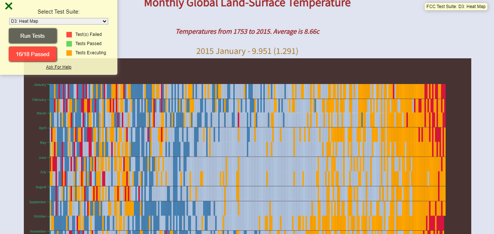

# Global Temperature Heatmap

This project utilizes D3.js to create a heatmap representing global temperature variances over time. It fetches temperature data from a JSON file and visualizes it on a canvas.

## Preview

## Files

- `index.html`: The main HTML file that displays the heatmap on a web page. It includes references to the CSS and JavaScript files.

- `styles.css`: The CSS file that defines the styles and layout of the heatmap and tooltip.

- `script.js`: The JavaScript file that contains the logic for fetching the temperature data, generating scales, drawing cells and axes, and handling interactions with the heatmap.

### Prerequisites

To run this project, you need a web browser that supports JavaScript.

### Installation

1. Clone the repository:

git clone https://github.com/your-username/your-repository.git

2. Navigate to the project directory:

cd your-repository

3. Open the `index.html` file in your web browser.

## Usage

Upon opening the `index.html` file, the heatmap will be displayed on the web page. Each rectangle represents a specific year and month, with the color indicating the temperature variance.

Hovering over a rectangle will display a tooltip showing the year, month, temperature, and variance.

## Customization

You can customize the appearance and behavior of the heatmap by modifying the variables and styles in the CSS and JavaScript files.

- `styles.css`: You can modify the styles to change the colors, dimensions, and other visual aspects of the heatmap and tooltip.

- `script.js`: You can adjust the variables in the JavaScript code to customize the dimensions of the canvas, padding, and colors used for different temperature variances.

## Contributing

Contributions are welcome! If you find any issues or have suggestions for improvements, please open an issue or submit a pull request.

## License

This project is licensed under the MIT License. See the [LICENSE](LICENSE) file for details.

